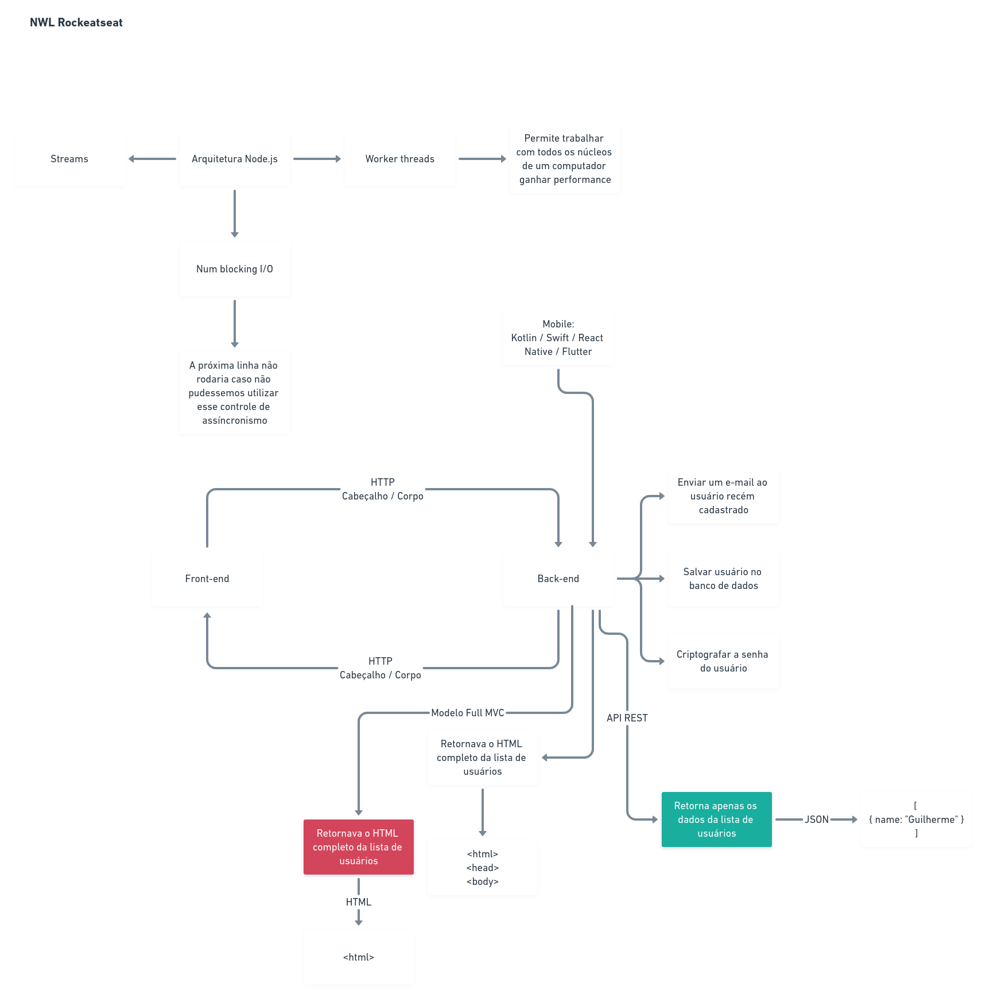

# BFF | Server

## Rodar a aplicação:

- `npm install` for install all dependencies;
- `npm start` for running dev application;

## What was used:

// TODO

## Diagram of node Architecture

  

## Features

### Connections

- [] End point for list all connections;
- [] End point for make a connection;

### Aulas

- [] End point for create one class route;
- [] End point for list all classes;
  - [] Filter class by discipline, week day, hour;
